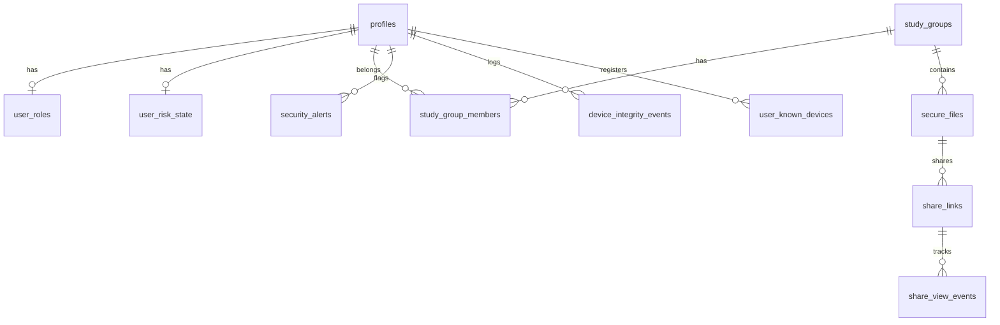

# Permanent AI Handover Document: NO SUS (SecureSend)

> [!IMPORTANT]
> **Read this file first.** This is the authoritative single source of truth for the project. Every future AI agent and developer should start by reading this document. Do not re-analyze the entire codebase from scratch; update this file whenever major architectural shifts or new features are introduced.

---

## 1. Project Overview

### Purpose & Vision
NO SUS is a secure, tracked, and watermarked document-sharing and private messaging platform. It is designed to give content creators, researchers, and privacy-conscious professionals complete visibility and control over external data access without forcing recipients to register accounts or install applications.

### Core Value Proposition
- **Deterrence and Attribution**: Since browser-level screenshot blocking is technically impossible, the app uses touch-to-reveal blur, dynamic identification watermarks, and granular view logs to deter and trace leaks.
- **Zero-Knowledge Architecture**: One-time secrets (Burn Notes, Burn Files) are encrypted client-side using keys stored only in the URL hash fragment. The server never receives key materials and deletes ciphertext atomically on read.
- **Frictionless Recipient Experience**: Recipients click a URL and view the protected document or file drop instantly inside a browser without any signup.
- **Zero-Budget Solo Leverage**: Optimized for a single developer. The backend resides on Supabase (Postgres, Auth, Edge Functions, Storage, Realtime) to maximize free-tier usage and eliminate infrastructure overhead.

### Current Development Stage
- **SecureSend (Active V1)**: File sharing via tracked, watermarked URLs with touch-to-reveal gates is fully built, live-tested, and deployed.
- **Burn Notes & Burn Files (Active V1)**: Zero-knowledge, self-destructing text drops and binary file drops with size caps and rate limiting are fully operational.
- **Sealed homomorphic intent graph (Shelved)**: An FHE-backed (Fully Homomorphic Encryption) matching system (M0–M2 complete) is built, database verified, and live on the Postgres scheme, but is currently **shelved**. It serves as a proven asset for future pivots. Do not build further Sealed milestones (M3+) without founder authorization.

---

## 2. Architecture & Design Patterns

### High-Level Architecture
The project is built as a hybrid mobile/web Flutter application interfacing with a Supabase backend. A Next.js marketing site (`homepage/`) is statically exported with basePath `/home` and deployed at `nosus.foo/home/` by the same GitHub Pages workflow; the Flutter web app permanently owns the `nosus.foo` root because burn/share links in the wild resolve against it. All homepage CTAs route to the app root; shared URLs are centralized in `homepage/src/lib/links.ts`.
```
┌────────────────────────────────────────────────────────┐
│                     Flutter Client                     │
│  (State: Riverpod | Router: main.dart | UI: Material)  │
└───────────┬──────────────┬──────────────┬──────────────┘
            │              │              │
       (Auth JWT)      (Anon HTTP)    (Anon HTTP)
            │              │              │
            ▼              ▼              ▼
┌────────────────────────────────────────────────────────┐
│                    Supabase Backend                    │
│                                                        │
│  ┌────────────────┐ ┌──────────────┐ ┌──────────────┐  │
│  │ Edge Functions │ │  Postgres DB │ │  Object Store│  │
│  │ (Deno Server)  │ │ (RLS & RPCs) │ │  (Storage)   │  │
│  └────────────────┘ └──────────────┘ └──────────────┘  │
└────────────────────────────────────────────────────────┘
```

### Clean Architecture Feature Separation
All new features are implemented in `lib/features/` and follow a strict Clean Architecture boundary:
- **`Domain`**: Pure Dart entities and abstract repository definitions. Decoupled from framework libraries.
- **`Data`**: Supabase implementations, local/network data sources, and models. Handles data mapping (e.g., `fromMap`, `toMap`).
- **`Presentation`**: Riverpod state providers, page controllers, and UI screens/widgets.

### Service-Singleton Architecture
Legacy or auxiliary subsystems (such as Screenshot blocking, Device integrity scanning, and Web Security event listeners) are designed as singleton service wrappers injected into Riverpod providers:
- `SupabaseService`: Direct live project DB proxy.
- `ScreenshotGuard`: Android screen protection listener.
- `DeviceIntegrityService`: Emits root, tampering, and concurrent device notifications.
- `WebSecurityGuard`: Controls browser copy, print, select, and DevTools detection.
- `AuditService`: Central security event Logger.

### Dependency Injection & State Management
- **Riverpod 3**: Manages state, handles asynchronous data streams (via `StreamProvider` and `FutureProvider`), and handles dependencies.
- **Synchronous Prefs Override**: `SharedPreferences` is pre-loaded at application startup inside `main()`, overriding `sharedPreferencesProvider` to avoid startup flash and theme resets.
- **Mock Fallback Pattern**: If Supabase credentials are missing or unreachable, the repositories switch dynamically to local memory/disk mock providers (e.g. `MockAuthRepository` vs `SupabaseAuthRepository`), allowing fully offline verification.

### Navigation and Boot Forking
- **Stand-alone Entrypoints**: In `lib/main.dart`, the URL is parsed via `_extractShareToken`, `_extractBurnNoteToken`, and `_extractBurnFileToken` *before* Supabase or Auth gates initialize. If a match is found, the normal app bootstrap is skipped and the standalone anonymous view screens are rendered directly, preventing session initialization overhead.
- **Active Navigation**: The main app features a 5-tab floating navigation dock (`FloatingNav`) mapping the main dashboards.

---

## 3. Tech Stack

| Layer | Technology | Purpose |
|---|---|---|
| **Frontend** | Flutter / Dart 3.12.1+ | Cross-platform web/mobile solo developer leverage. |
| **State / DI** | `flutter_riverpod` | State binding and asynchronous loaders. |
| **Backend** | Supabase | Database, JWT Authentication, Object Storage, and Edge compute. |
| **Database** | PostgreSQL | RLS, RPCs, pg_cron hourly sweeps, and pg_net http triggers. |
| **Serverless Compute** | Deno (Edge Functions) | public/service-role bridges bypassing RLS securely. |
| **FHE Subsystem** | Rust (`TFHE-rs`) | Shelved microservice doing encrypted evaluation. |
| **PDF Rendering** | `pdfrx` | High-fidelity PDF viewer with text-selection disabling. |
| **Mobile Security** | `screen_protector` | Toggles `FLAG_SECURE` on Android devices. |
| **Client Crypto** | `encrypt` (AES-256-CBC) | Zero-knowledge client-side encryption. |

---

## 4. Source Code Map

### Core directories and files
- `lib/main.dart`: Root entrypoint. Customizes deep-linking (`app_links`), initial boot forks for anonymous link recipients, and startup security audits.
- `lib/theme.dart`: Design token definitions. Implements `NoSusTheme` monochrome styles (black, white, grays, and rounded cards).
- `lib/core/`:
  - `providers/`: Theme and preferences listeners.
  - `supabase/`: Bootstrapping code (`SupabaseBootstrap`) and providers.
  - `mascot/`: Character controllers for Rive animated mascots (Lux, Nox, Duo).
- `lib/services/`:
  - `audit_service.dart`: Client-side proxy logger using `log_group_event`.
  - `device_integrity_service.dart`: Collects device root, Frida/LSPosed, and multi-device access flags.
  - `risk_engine_service.dart`: Monitors database risk scoring.
  - `screenshot_guard.dart`: Listens to screenshot events.
  - `web_security_guard.dart`: Emits browser deterrents and checks DevTools.
- `lib/features/`:
  - `auth/`: Screens (`auth_screen.dart`, `reset_password_screen.dart`), repository, and providers.
  - `groups/`: Group detail UI (`group_detail_screen.dart`), rosters, invites, and landing gates.
  - `workspace/`: Dashboard dashboard pages (`workspace_tab.dart`), study desk (`study_desk_tab.dart`), and security chart.
  - `share/`: 
    - `data/`: Clients (`share_fetch_client.dart`, `share_heartbeat_client.dart`, `burn_file_client.dart`).
    - `domain/`: Entities (`ShareLink`, `ShareViewEvent`).
    - `presentation/`: Standalone anonymous viewer views and dialog triggers (`share_link_dialog.dart`, `burn_note_viewer_screen.dart`, `burn_file_viewer_screen.dart`).

---

## 5. Data Flow

### 1. Dynamic Sharing (SecureSend)
```
[Sender Client] ───► inserts `share_links` row ───► generates token url
                                                         │
[Recipient Browser] ◄─── opens hash token url ◄──────────┘
       │
       ▼
calls anonymous `share-fetch` Edge Function
       │
       ├─► (Verifies expiration, view limits, and email format)
       ├─► (Appends a view event to `share_view_events`)
       ├─► (Mints a 5-minute Storage signed URL)
       ▼
returns { file_name, signed_url, blur_enforced, watermark_enforced }
       │
       ▼
downloads bytes directly via CDN signed_url ───► renders in SecureDocumentViewer
```

### 2. Zero-Knowledge Burn Notes & Burn Files
```
[Uploader Client]
  1. Generates 256-bit AES Key and 128-bit IV locally.
  2. Encrypts payload (content or binary packed with metadata).
  3. Uploads ciphertext to DB/Storage (anonymously).
  4. Generates URL: `/#/burn/<uuid>?k=<keyHex>&v=<ivHex>` (Key/IV kept in fragment).
       │
[Recipient Client]
  1. Opens URL. URL fragment (Key/IV) remains strictly client-side.
  2. Invokes claim RPC (`read_and_burn_note` or `claim_burn_file`).
  3. DB atomically deletes the row and returns the raw base64 ciphertext.
  4. Client decrypts ciphertext in-memory using Key/IV.
  5. Content displayed (with 60s self-destruct) or downloaded as raw file.
```

---

## 6. Database Schema & RLS Policies



### Active Core Tables

#### `profiles`
Tracks user display names, avatars, and onboarding selections.
- **Fields**: `id` (uuid, PK), `email` (text), `display_name` (text), `avatar_color_start`/`avatar_color_end` (text), `onboarding_completed` (bool), `avatar_id` (int), `survey_goals`/`survey_features` (text[]), `survey_user_type` (text), `updated_at` (timestamptz).
- **RLS**: Select policy opens to all authenticated users. Update policy is restricted to owner only (`id = auth.uid()`).

#### `study_groups`
Tracks group workspaces and metadata.
- **Fields**: `id` (text, PK), `name` (text), `description` (text), `is_watermark_enabled` (bool), `invite_code` (text), `file_count` (int), `last_activity`/`created_at` (timestamptz).
- **RLS**: SELECT restricted to group members (verified via `is_group_member(id)` RPC).

#### `study_group_members`
Junction table mapping users to groups.
- **Fields**: `group_id` (text, FK), `user_id` (uuid, FK), `is_admin` (bool), `joined_at` (timestamptz). PK: `(group_id, user_id)`.
- **RLS**: SELECT restricted to group members.

#### `secure_files`
Metadata for uploaded group documents.
- **Fields**: `id` (text, PK), `group_id` (text, FK), `name` (text), `type` (text), `size_bytes` (int), `is_watermarked` (bool), `is_pinned` (bool), `security_status` (text, CHECK), `uploaded_at` (timestamptz), `storage_path` (text), `gdrive_file_id` (text), `key_id` (text), `uploaded_by` (uuid), `owner_id` (uuid).
- **RLS**: SELECT restricted to group members. INSERT/UPDATE/DELETE restricted to owner or group admins.

#### `audit_logs`
Hash-chained ledger logging group activities (uploads, downloads, screenshots).
- **Fields**: `id` (uuid, PK), `group_id` (text, FK), `actor_id` (uuid, FK), `file_id` (text, FK), `event_type` (text, CHECK), `metadata` (jsonb), `previous_hash` (text), `entry_hash` (text), `created_at` (timestamptz).
- **RLS**: SELECT open to group members. Direct inserts/updates are disabled. Writes occur only via `log_group_event` RPC.
- **Hash Trigger**: Automatically computes `entry_hash` using `SHA256` of `actor_id || event_type || created_at || previous_hash`.

#### `share_links`
Tracks SecureSend share tokens.
- **Fields**: `id` (uuid, PK), `token` (text, unique), `file_id` (text, FK), `created_by` (uuid, FK), `revoked` (bool), `expires_at` (timestamptz), `max_views` (int), `view_count` (int), `require_touch_reveal` (bool), `created_at` (timestamptz).
- **RLS**: SELECT/UPDATE only permitted to creator (`created_by = auth.uid()`). Direct SELECT is blocked for anon; retrieval happens strictly via `share-fetch` Edge Function.

#### `share_view_events`
Tracks views of active share links.
- **Fields**: `id` (uuid, PK), `link_id` (uuid, FK), `viewer_email` (text), `device_type` (text), `started_at` (timestamptz), `last_heartbeat` (timestamptz), `ended_at` (timestamptz), `duration_seconds` (generated int), `suspicious_events` (jsonb array).
- **RLS**: SELECT only allowed to the link's creator.

#### `device_integrity_events`
Hash-chained ledger logging root, tampering, and session locks.
- **Fields**: `id` (uuid, PK), `user_id` (uuid, FK), `device_id` (text), `event_type` (text, CHECK), `severity` (text), `metadata` (jsonb), `previous_hash` (text), `entry_hash` (text), `created_at` (timestamptz).
- **RLS**: SELECT restricted to self (`user_id = auth.uid()`).
- **Hash Trigger**: Generates `entry_hash` dynamically on `BEFORE INSERT`.

#### `user_risk_state`
Realtime risk calculation state computed server-side.
- **Fields**: `user_id` (uuid, PK), `score` (int), `tier` (text, FK), `watermark_intensity` (text), `session_locked` (bool), `require_reauth` (bool), `breakdown` (jsonb), `updated_at` (timestamptz).
- **RLS**: SELECT restricted to self or super-admins. Writes occur via trigger recomputations.

---

## 7. Security Architecture & Threat Model

### Cryptographic Boundaries
- **AES-256-CBC Encryption**: In Burn Notes and Burn Files, encryption occurs client-side. The database table `burn_notes` only stores the raw base64 ciphertext. The cryptographic key and IV are kept in the URL hash fragment, meaning they never pass to Supabase or network proxies.
- **Single-Use claiming (Zeroization)**: Claiming a Burn Note or Burn File deletes the database row/storage object atomically using `DELETE ... RETURNING` or `UPDATE ... SET consumed_at = now() WHERE consumed_at IS NULL` to prevent race-condition replays.

### Client-Side Deterrents & Detections
- **Screenshot Guard (Mobile)**: Calls native Android methods to enable `FLAG_SECURE`, preventing native system screen captures or video recording, throwing funny warning modals to explain policies.
- **Web Security Guard (Web)**:
  - Disables right-clicks, copying, cutting, text selection, and print/save shortcut keys.
  - Appends `@media print` style overrides hiding page visibility if printing is forced.
  - Checks Navigator webdriver flags to detect automation.
  - Polls inner/outer window layout changes to detect DevTools opening.
  - Fires `share-heartbeat` calls containing suspicious event tags when active inspection is detected.

---

## 8. Implemented Features

### 1. SecureSend (Active)
- **Purpose**: Creates tracked, watermarked document link sharing without recipient registration.
- **Entry Point**: File options menu inside `group_detail_screen.dart` triggering `showShareLinkDialog`.
- **Primary files**: `lib/features/share/presentation/widgets/share_link_dialog.dart`, `anonymous_share_viewer_screen.dart`, `share_fetch_client.dart`.
- **Services Used**: `WebSecurityGuard`, `SupabaseService`.

### 2. Zero-Knowledge Burn Notes (Active)
- **Purpose**: Exchanging self-destructing text notes client-side encrypted.
- **Entry Point**: "Burn Note" teaser card in `workspace_tab.dart` opening `BurnNoteCreatorScreen`.
- **Primary files**: `burn_note_creator_screen.dart`, `burn_note_viewer_screen.dart`.
- **Dependencies**: `encrypt` package.
- **Limitations**: Max note length is constrained to 10,000 characters to prevent overflow.

### 3. Zero-Knowledge Burn Files (Active)
- **Purpose**: One-time binary file drop self-destructing immediately on download.
- **Entry Point**: "Burn File" teaser card in `workspace_tab.dart` opening `BurnFileCreatorScreen`.
- **Primary files**: `burn_file_creator_screen.dart`, `burn_file_viewer_screen.dart`, `burn_file_client.dart`, `burn_file_crypto.dart`.
- **Dependencies**: `file_picker`, `share_plus`.
- **Limitations**: Max size capped at 50MB default to prevent browser memory exhaustion during AES decryption.

---

## 9. Configuration & Build Variables

### Environment Variables (`.env`)
- `SUPABASE_URL`: Endpoint of the Supabase API.
- `SUPABASE_ANON_KEY`: Client anon key.
- `SUPABASE_SERVICE_ROLE_KEY`: Admin role key (never stored on clients).
- `BURN_FILES_IP_SALT`: Secret salt used to compute hashed rate-limit IP records.
- `FHE_COMPUTE_URL`/`FHE_SERVICE_TOKEN`: Upstream container credentials (for shelved Sealed operations).

### Android Permissions (`AndroidManifest.xml`)
- `android.permission.INTERNET`: Core networking.
- `android.permission.RECEIVE_BOOT_COMPLETED`: Native boot link streams.
- `android.permission.SYSTEM_ALERT_WINDOW`: Screen overlay detection.

---

## 10. Known Issues, Tech Debt & Bottlenecks

### 🔴 High Priority / Bugs
- **Phone OTP Missing Cooldown**: The phone OTP validation screen lacks a resend timer, leaving it prone to user-level registration spam.
- **Web Renderer constraints**: The browser preview harness fails to render CanvasKit/WASM Flutter builds, requiring Python static server fallback testing (`python -m http.server 5051 --directory build/web`).

### ✅ Resolved 2026-07-11 (integration pass)
- **Function-grant least privilege**: all pre-burn_files-era SECURITY DEFINER RPCs had default `PUBLIC EXECUTE`; now revoked (`20260711000000_function_grants_least_privilege.sql`). Only `read_and_burn_note` and `get_invite_details` remain anon-callable (by design). Avatars-bucket listing policy dropped (app uses public object URLs).
- **RLS initplan**: all 24 policies with bare `auth.uid()` now use `(select auth.uid())`; covering FK indexes added (`20260711010000_rls_initplan_and_fk_indexes.sql`).

### 🟡 Technical Debt
- **Shelved FHE Codebase**: The FHE microservice holds mock bindings and unfinished `todo!` markers in `abstraction.rs`.
- **Postgres Webhook matching**: Intent graph evaluation relies on client-side triggers (`SealedApiClient.runMatcher`) instead of a robust Postgres webhook, introducing potential match-drop risks.

---

## 11. Testing & Verification

The testing suite relies on `mocktail` for mocks and is executed via `flutter test`:
- `test/unit/deep_link_parsing_test.dart`: Validates Burn Notes and Burn Files URL token extraction.
- `test/unit/burn_file_crypto_test.dart`: Validates packed AES payloads, name packing, and unpacking.
- `test/db_test.dart` / `supabase_service_test.dart`: Validates offline mockup behaviors and DB calls.
- **Future tests needed**: RLS negative checks (proving an unauthorized user can't select rows) and multi-account E2E integration tests.

---

## 12. Coding Conventions & AI Context

### Core Guidelines
- **Zero Raw Prints**: Avoid `print()`. Use `debugLog()` to output messages.
- **Keep Lines Short**: Format bullet points and lines to avoid wrapping.
- **No Direct Repo Bypass**: Keep database interaction logic in data layer repositories (never inside screens or presentation widgets).
- **Aesthetic Monochrome Premium**: Retain the `NoSusTheme` monochrome visual tokens. Avoid default reds/blues/greens; use HSL tailored states or dark templates.
- **Preserve Shelved Assets**: Do not delete FHE or Sealed codebase artifacts; preserve them as dormant directories in case of a future pivot.

---

## 13. File Dependency Map

```
lib/main.dart (Entrypoint, AppLinks, Boot Forking)
   │
   ├──► lib/core/supabase/supabase_bootstrap.dart
   │
   ├──► lib/services/screenshot_guard.dart
   │       └──► lib/services/audit_service.dart
   │
   ├──► lib/services/device_integrity_service.dart
   │       └──► lib/services/supabase_service.dart
   │
   ├──► lib/features/share/presentation/screens/anonymous_share_viewer_screen.dart
   │       ├──► lib/features/share/data/share_fetch_client.dart
   │       └──► lib/features/share/data/share_heartbeat_client.dart
   │               └──► lib/services/web_security_guard.dart
   │
   ├──► lib/features/share/presentation/screens/burn_note_viewer_screen.dart
   │
   └──► lib/features/share/presentation/screens/burn_file_viewer_screen.dart
           └──► lib/services/burn_file_crypto.dart
```

---

## 14. Quick Start (AI Reading Order)

To become productive in the codebase immediately, read files in this specific sequence:
1. `PROJECT_CONSTITUTION.md`: The permanent guide on project vision and coding rules.
2. `lib/main.dart`: To understand the startup deep-linking, boot routing, and initialization gates.
3. `lib/features/share/presentation/screens/anonymous_share_viewer_screen.dart`: The core of the tracked document-viewing workflow.
4. `lib/services/web_security_guard.dart`: To understand the web-side detection heuristics.
5. `supabase/migrations/20260710030000_risk_engine.sql`: To understand the risk scoring trigger logic.
