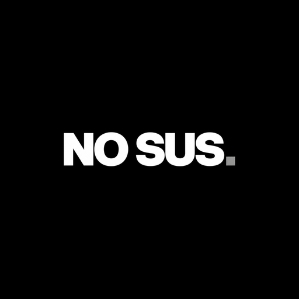

<div align="center">

# 🥷 NO SUS
**The Silent Security Workspace for Students**

[](https://flutter.dev/)
[](https://supabase.com/)
[](https://dart.dev/)
[](#)

*Share notes, solutions, and research within private groups — with screenshot protection, dynamic watermarking, audit trails, and a secure blur-to-reveal viewer.*



</div>

---

## ⚡ The Vibe

NO SUS is built with a **monochrome, dark-mode-first aesthetic**, taking inspiration from retro hacker terminals and modern pixel art. It isn't just a file-sharing app; it's a **secure vault** for your study groups. Trust no one. Audit everything. 

<div align="center">
  
  <br>
  <i>(Screenshot placeholders - replace with actual app screenshots!)</i>
</div>

---

## 🛡️ Core Features

### 🔐 True End-to-End Encryption (E2EE)
Files are encrypted **client-side** before they even touch the network. Supabase stores the encrypted blobs, but only you and your group members hold the keys.

### 🚫 Anti-Leak Protection
- **Screenshot Blocking**: Enforces `FLAG_SECURE` on Android to prevent unauthorized screen captures.
- **Dynamic Watermarking**: Imprints the viewer's identity (UUID/Email) dynamically across the document canvas.
- **Blur-to-Reveal**: Documents are heavily blurred by default. Users must actively press and hold to reveal the content under their finger, making stealthy photo-taking nearly impossible.

### 📜 Tamper-Evident Audit Logs
Every file view, group join, and permission change is immutably logged to Supabase. Monitor your workspace activity in real-time.

### 👥 Secure Study Groups
Invite-only private study groups with Strict Role-Based Access Control (RBAC) enforced at the database level via Supabase Row Level Security (RLS).

### 👾 Pixel Identity
Express yourself anonymously. Choose from custom pixel-art avatars (Builder, Researcher, Agent, Chaos) specifically designed to blend with the sleek dark mode UI.

---

## 🛠️ The Stack

- **Frontend**: Flutter (Cross-platform: Android, iOS, Web, Desktop)
- **Backend**: Supabase (PostgreSQL, Storage, Auth, Realtime)
- **State Management**: Riverpod (`flutter_riverpod`)
- **Animations**: `flutter_animate`
- **Security**: `cryptography` (AES-GCM), `flutter_secure_storage`, `screen_protector`

---

## 🚀 Quick Start

### 1. Clone & Install
```bash
git clone https://github.com/YOUR_USER/no_sus.git
cd no_sus
flutter pub get
```

### 2. Configure Environment
Create a `.env` file in the root directory:
```env
SUPABASE_URL=https://your-project.supabase.co
SUPABASE_ANON_KEY=your-anon-key
```

### 3. Run the App
```bash
# Run with live Supabase (requires .env)
flutter run --dart-define-from-file=.env

# Build a release APK
flutter build apk --release --dart-define-from-file=.env --build-name=1.0.0 --build-number=1
```

> **Note**: NO SUS includes an **Offline Fallback / Mock Mode**. If you run the app without a `.env` file (`flutter run`), it will automatically fall back to mock repositories, allowing you to experience the UI and flows without a Supabase backend!

---

## 🏗️ Supabase Architecture & Setup

This project relies heavily on **Supabase Row Level Security (RLS)** to enforce study group boundaries.

1. **Database Schema**: Push the migrations found in `supabase/migrations/`:
   ```bash
   supabase db push
   ```
2. **Tables Created**:
   - `profiles`: User identities and avatar preferences.
   - `study_groups`: Group metadata.
   - `study_group_members`: Membership links and RBAC.
   - `secure_files`: File metadata (pointers to Storage).
   - `audit_logs`: The immutable activity ledger.
3. **Storage Bucket**: The migration automatically creates a `secure-files` private bucket with RLS policies strictly allowing only authenticated group members to upload/download.

---

## 📜 License

This project is licensed under the MIT License - see the [LICENSE](LICENSE) file for details.

<div align="center">
  <br>
  <i>Stay secure. Stay stealthy. No sus.</i>
</div>
