

# `[ N O  S U S ]`
### **USER OPERATIONS MANUAL**
*Confidentiality Level: Maximum*

***

### 📠 `INITIALIZATION SEQUENCE`
Welcome to **NO SUS**. This is not a regular file-sharing app. This is a secure vault designed for study groups where privacy, accountability, and secrecy are paramount. 

Everything you do here is encrypted. Everything you share is protected. Every action is logged.

If you are reading this, you have successfully installed the client. Below is your operational guide.

***

### 📂 `THE VAULT: INTERFACE & THEME`
The workspace operates on a strict **monochrome protocol**. Black ink, white paper, pixelated interfaces. No distractions, just secure data transfer.

  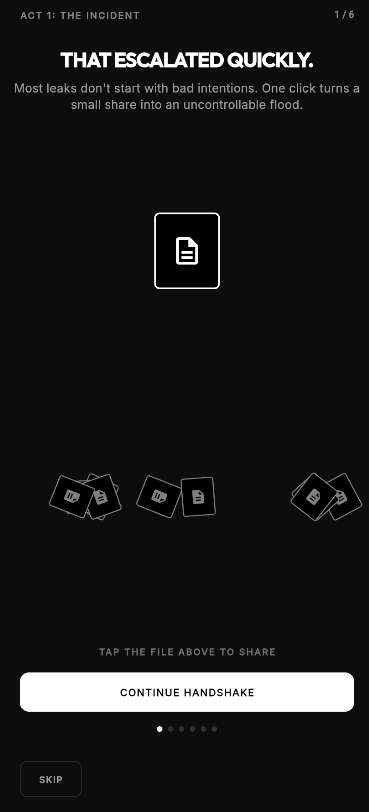
  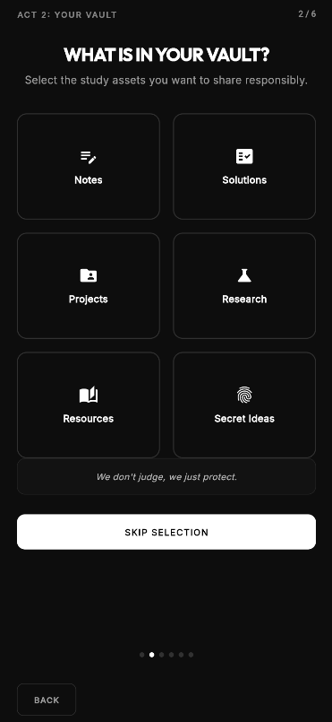
  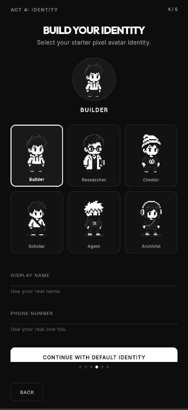

***

### 👤 `PROTOCOL 1: PIXEL IDENTITY`
Upon first launch, you will forge your identity. 
You will select a **Pixel Avatar** (Builder, Researcher, Agent, Archivist) and set your display name. 
This is how you will be recognized within your secure groups. Choose wisely.

  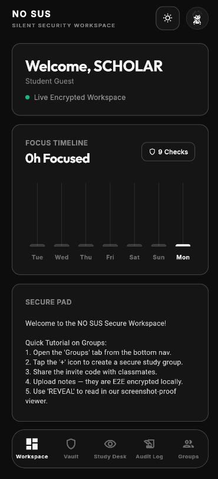
  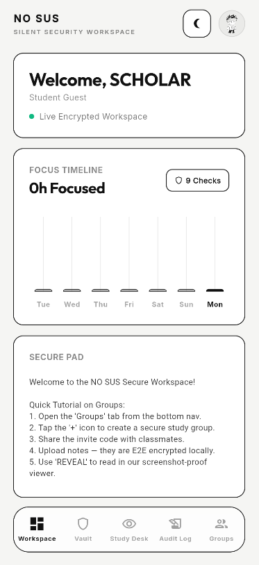

***

### 🏢 `PROTOCOL 2: SECURE STUDY GROUPS`
You cannot share files in the open. All intelligence must be shared within **Study Groups**.
1. **Create** a new group or **Join** an existing one using an invite code.
2. Group **Admins** have ultimate authority to remove members or delete shared files.
3. Once inside, you can access the shared intelligence pool.

  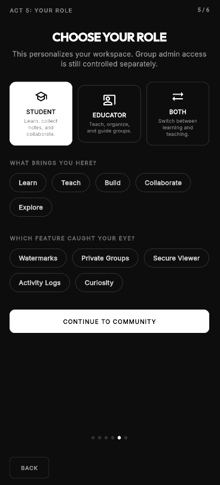
  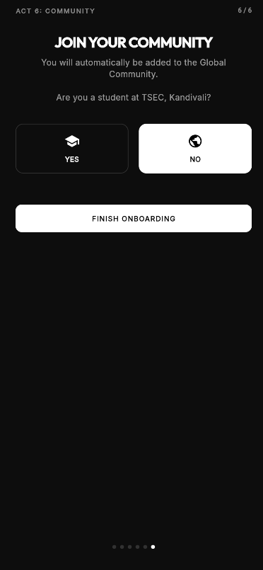
  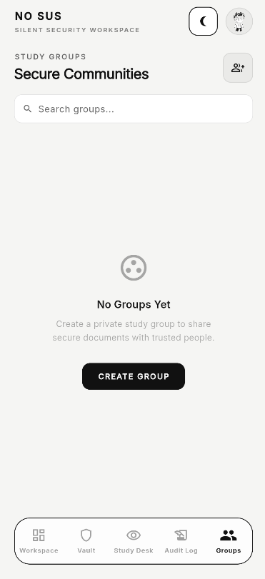

***

### 📤 `PROTOCOL 3: SECURE TRANSMISSION (UPLOAD)`
To share a document (PDF, Note, Image) or a Google Drive link:
- Navigate to your group.
- Hit **Upload**.
- The file is **End-to-End Encrypted** on your device *before* it leaves your phone. Only members of your group possess the decryption keys.

  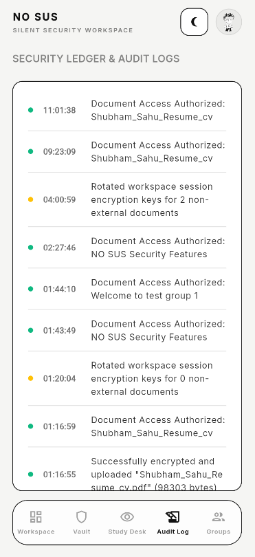
  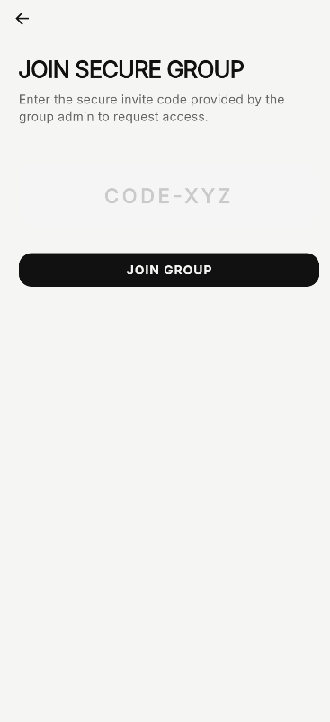

***

### 👁️‍🗨️ `PROTOCOL 4: THE SPYGLASS VIEWER (ANTI-LEAK)`
We assume someone is always watching.
When you open a secure document, you will see nothing but blur and noise.

- **Hold to Reveal**: You must physically press and hold your finger on the screen to reveal the document beneath your touch. When you let go, it encrypts visually again.
- **Dynamic Watermarks**: Your name and identity are aggressively stamped across the document canvas.
- **Screenshot Protection**: The app prevents screenshots from being taken at the OS level. If someone tries to photograph your screen with another phone, their photo will be covered in your watermarks, proving *who* leaked it.

  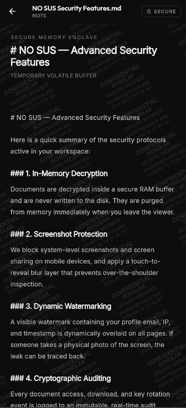
  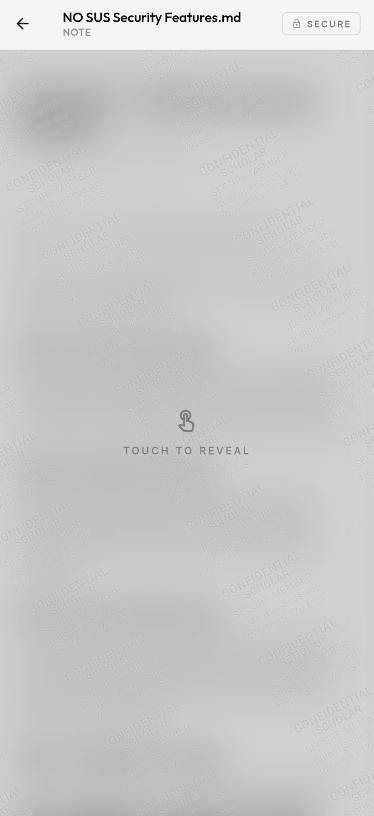

***

### 📜 `PROTOCOL 5: THE LEDGER (AUDIT LOGS)`
Trust no one. The **Audit Log** tracks everything.
Every time a user joins a group, uploads a file, or even *views* a document, it is recorded immutably on the ledger. Group members can monitor exactly who is accessing what, and when.

  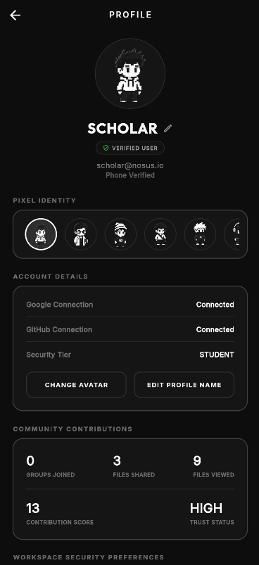
  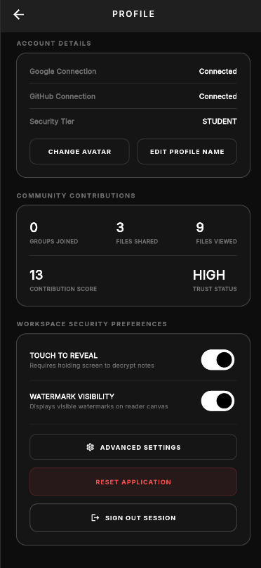

***

### ⚙️ `SETTINGS & ACCOUNT`
You can manage your workspace security preferences in the profile section. Here you can track your "Contribution Score" and verify your security tier.

  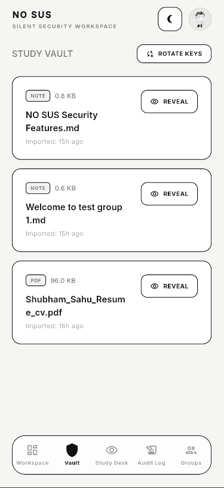
  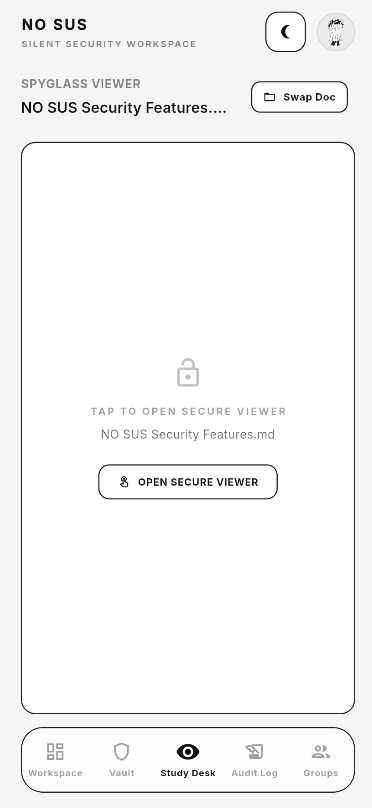

***

### ⚠️ `FINAL WARNING`
`> ENCRYPTION KEYS ARE STORED LOCALLY.`
`> IF YOU DELETE THE APP, YOUR KEYS ARE DESTROYED.`
`> STAY SECURE. STAY STEALTHY.`

`<END OF TRANSMISSION>`
